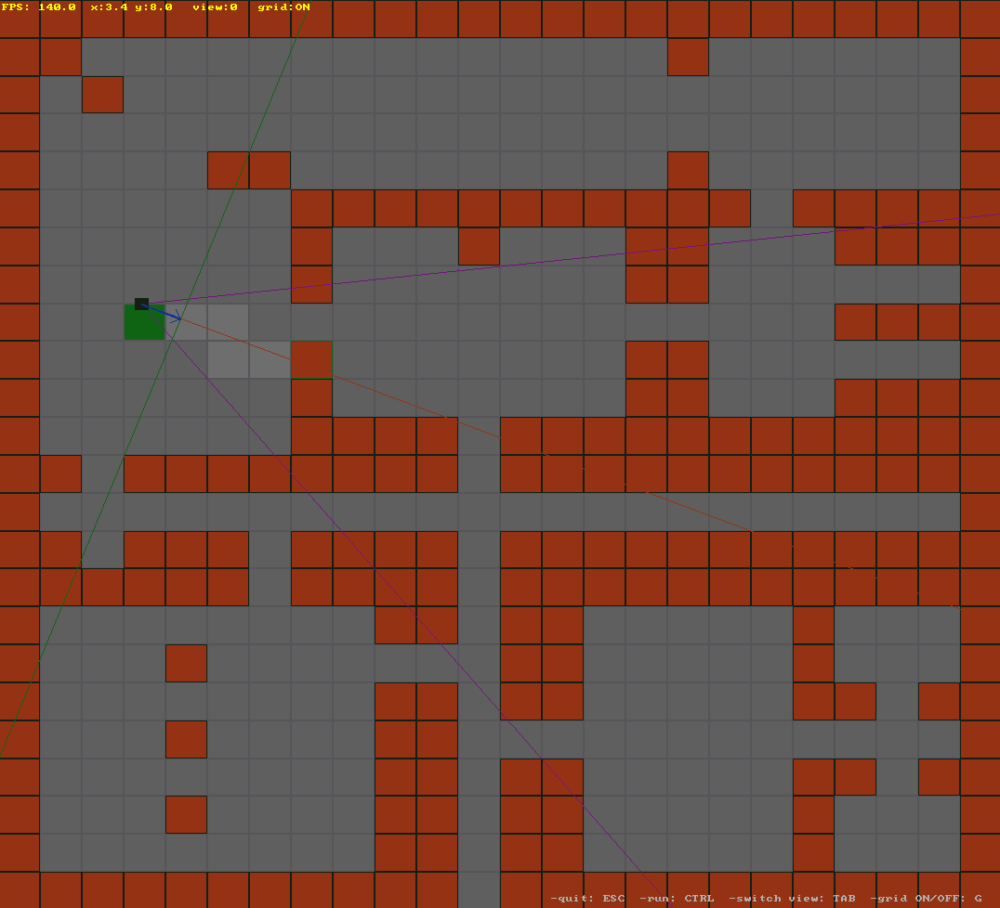
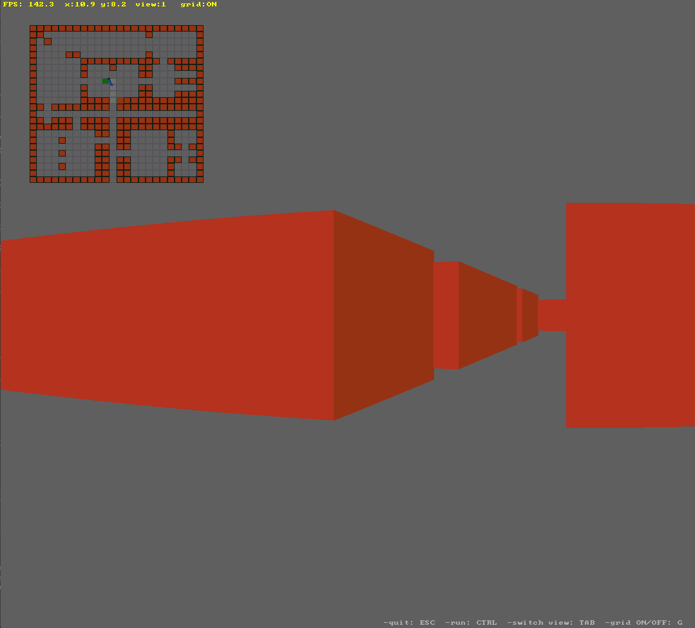

# Custom untextured raycasting
My custom implementation of raycasting following Lode's raycasting tutorial.

**ESC**: quit  
**TAB**: switch view  
**G**: toggle ON/OFF grid on 2D map  
**LCTRL**: run faster

## 2D view from above

## 3D view with minimap

